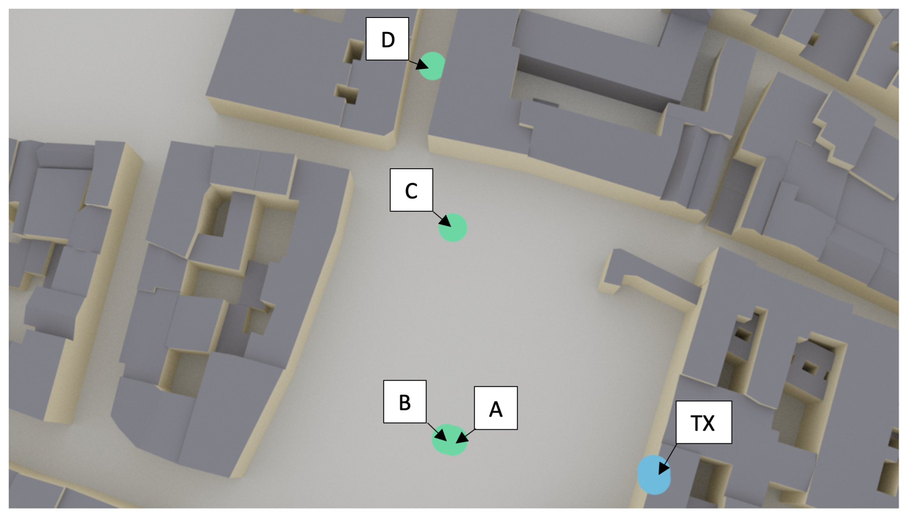

# LELEC2796_Project
Project for the course [LELEC2796](https://uclouvain.be/en-cours-2023-lelec2796) (2023-2024) <br>
By [Côme Wallner](https://github.com/elCarac) & [Jérôme Lafontaine](https://github.com/JeromeLafontaine)

**Teachers**: [Pr. Claude Oestges](https://en.wikipedia.org/wiki/Claude_Oestges) & [Pr. Luc Vandendorpe](https://uclouvain.be/fr/repertoires/luc.vandendorpe) <br>
**Teaching assistant**: [Jérome Eertmans](https://github.com/jeertmans)

---
This document will give informations about how to work with the files from this Github and how to get results.


## Introduction
The GitHub is organized as followed:
- 3 folders: **Matrices**, **Articles** and **results**
- 2 Jupyter notebooks: **project** and **project_channel_calculation** 
- 4 utils python codes: **utils_Alamouti**, **utils_eigen_TX2_RX1**, **utils_eigen** and **utils_TX2_RX1**


The main code to run is the **project.ipynb**. This notebook is based on **sionna** package from Python and the notebook will install it directly. The other python's packages used in this project are:


1. pandas
2. matplotlib
3. numpy
4. scipy
5. os
6. tensorflow

If one of these packages is not installed on your laptop, you can do the following command:

```bash
pip install <package>
```
Be careful about the Sionna package. It will be safer to create an environment for it.

## Documents' description
### Articles folder description
In this folder, there are two documents:

1. **Alamouti Paper**: *A Simple Transmit Diversity Technique for Wireless Communications*  by Siavash M. Alamouti in 1998.

2. **Optional_Report_Jérôme_Côme**: *Comparative analysis of Alamouti and Dominant Eigenmode Transmission schemes using OFDM in MIMO and MISO systems* by Jérôme Lafontaine and Côme Wallner in 2023.
   Inside this report are the results from the different simulations obtained thanks to this project and the analysis.

### project.ipynd description
This notebook will be based on the 4 utils codes and the **matrices** folder, more precisely the different **channel_matrix** python codes. The **channel_matrix** Python code will provide the different matrices used for the channel in the notebook. 

You just have to run all cells to obtain the results from this notebook. In the first slides the parameters can be chosen (the positions of the receivers (starting point and end points) have to be chosen with values linked to the position as explained in the code). The possible positions are represented in the article linked to this project. If new positions (other than the ones presented in Fig. 1) want to be used, project_channel_calculation.py needs to be modified and used and new channel matrices need to be generated. 


<p align="center">
   
  Fig. 1: Scenario and positions used in this project
</p>

#### 1. utils_Alamouty.py description
Files which contain the useful functions of the MIMO Alamouti coding. This file is used in the project.ipynb file.

#### 2. utils_eigen_TX2_RX1.py description
Files which contain the useful functions of the MISO dominant eigenmode transmission. This file is used in the project.ipynb file.


#### 3. utils_eigen.py description
Files which contain the useful functions of the MIMO dominant eigenmode transmission. This file is used in the project.ipynb file.

#### 4. utils_TX2_RX1.py description
Files which contain the useful functions of the MISO Alamouti coding. This file is used in the project.ipynb file.

### project_channel_calculation.py description
This is used to generate the channel matrix with ray tracing. The positions are hardcoded and the code needs to be changed manually to change the UE's (user equipment) positions. 
Those values are the one given the results in the report. They can be changed if the scenario needs to be adapted.
